# 5 分钟，将你的幻兽帕鲁服务器迁移到计算巢

使用计算巢一键搭建幻兽帕鲁服务器的玩家，可以在控制台上直界面化修改死亡掉落等配置。
但如果你创建了 ECS，通过 ECS 扩展程序（OOS）来安装的幻兽帕鲁服务器，就没有这些界面化管理功能，需要登陆服务器手动修改配置文件，非常不方便。

为了解决这个问题，现在计算巢支持将你的幻兽帕鲁服务器迁移到计算巢来管理，让你也可以通过界面来管理配置项、升级游戏服务器。

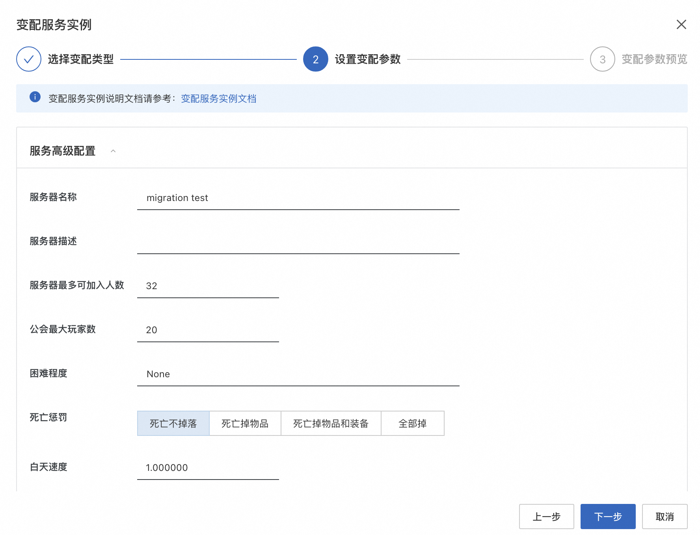

升级过程非常简单，只需三步：
1. 备份存档
2. 创建计算巢幻兽帕鲁管理服务
3. 恢复存档

如果你原来的幻兽帕鲁服务器上还没有存档，那么你只需一步：创建计算巢管理幻兽帕鲁服务。

<hr/>

## 操作步骤
### 1. 备份存档（无存档可跳过）
为了使用计算巢的能力来管理幻兽帕鲁服务器，计算巢需要先将你的 ECS 服务器重置为计算巢定制的操作系统镜像。
所以，如果你的服务器上已经有了存档，为了避免你和帕鲁的努力白费，建议先备份存档。

#### 1.1 Windows 系统的 Palworld 存档备份
如果你原来是通过 ECS 扩展程序（OOS）安装的幻兽帕鲁服务器，且操作系统为 Windows，你可以在这个路径下找到幻兽帕鲁的服务器存档：
```
C:\Program Files\PalServer\steam\steamapps\common\PalServer\Pal\Saved
```
你可以通过远程连接登陆到 ECS 服务器，将该目录打包下载到本地，用于备份。
具体操作：
1. 访问 [ECS 控制台](https://ecs.console.aliyun.com/server)，找到你的服务器，点击 **远程连接** > **立即登录**。注意不要选择免密登陆。

    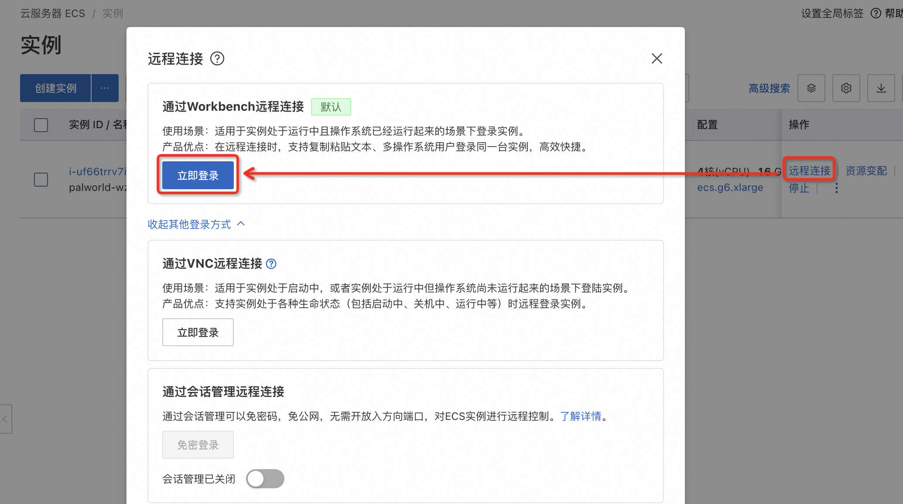
2. 找到存档位置，将存档目录打包成 zip 包。

    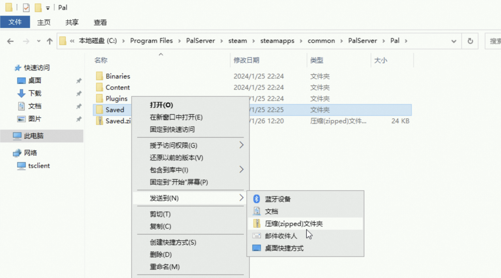
3. 将压缩后的存档文件，拖动到 workbench\Download 目录后，就会触发浏览器的文件下载，然后将其下载到本地。

    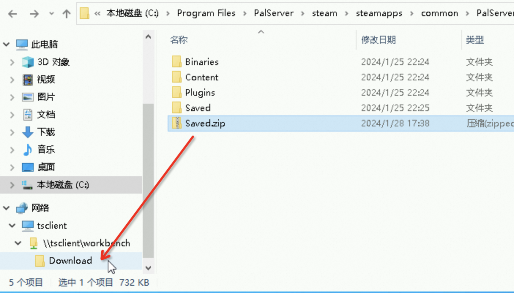
<hr/>

### 1.2 Linux 系统的 Palworld 存档备份
如果你原来是通过 ECS 扩展程序（OOS）安装的幻兽帕鲁服务器，且操作系统为 Linux，你可以在这个路径下找到幻兽帕鲁的服务器存档：
```
/PalSaved
```
你可以远程登录到 ECS 服务器，将该目录打包下载到本地，用于备份。
具体操作：
1. 访问 [ECS 控制台](https://ecs.console.aliyun.com/server)，找到你的服务器，点击 **远程连接** > **立即登录**。

    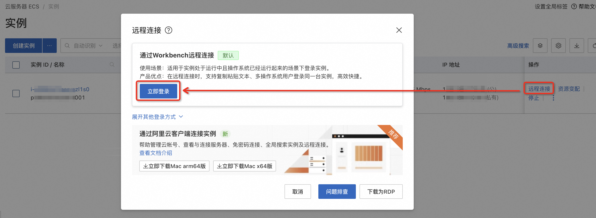
2. 找到存档位置，使用如下命令将存档打包：
   ```bash
   tar -cvf /PalSaved.tar /PalSaved
   ```
3. 打包完成后，在 ECS 远程连接界面，点击左上角的文件，**打开文件树**。在打包后的 /PalSaved.tar 文件上右键，选择 **下载文件**。

    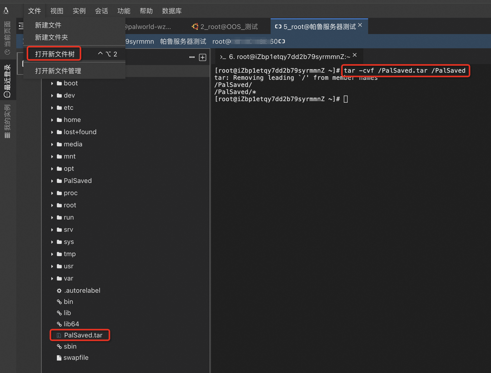
<hr/>

## 2. 创建计算巢幻兽帕鲁管理服务（迁移到计算巢）
这一步骤非常简单，你只需要根据计算巢的界面指引完成即可。具体操作：
1. 访问[计算巢幻兽帕鲁管理服务](https://computenest.console.aliyun.com/service/instance/create/cn-hangzhou?type=user&ServiceId=service-959ba5511d6c481fbb50)。
2. 然后选中你需要迁移的服务器，并根据指引，完成创建即可。

   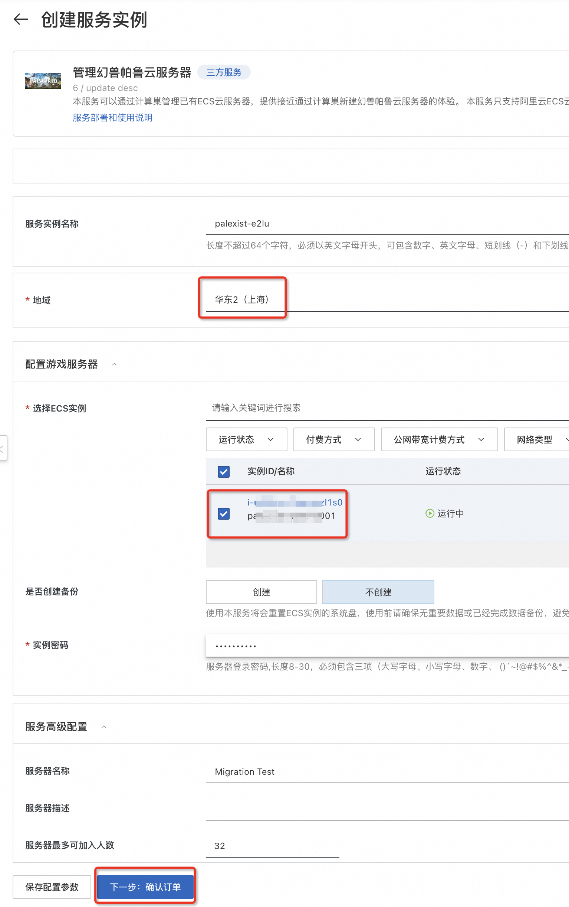

等待大约 5 分钟，任务就会执行完成，然后你可以在这里获取到新的服务器 IP 及端口。

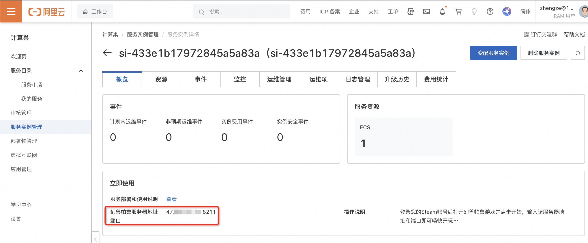

<hr/>

## 3. 恢复存档
### 3.1 Windows 系统的存档恢复
如果你原来是在 Windows 上搭建的 Palworld 服务器，通过计算巢迁移后，仍然会是 Windows 系统。为了恢复存档，你需要将步骤 1 中备份的存档覆盖到这里：
```
C:\Program Files\PalServer\steam\steamapps\common\PalServer\Pal\Saved
```

具体操作：
1. 参考步骤 1，远程连接到 Windows 服务器桌面
2. 打开文件夹，将本地的存档 zip 文件，直接拖拽到浏览器中，即可将存档文件传到服务器中的 workbench 文件交换目录。

    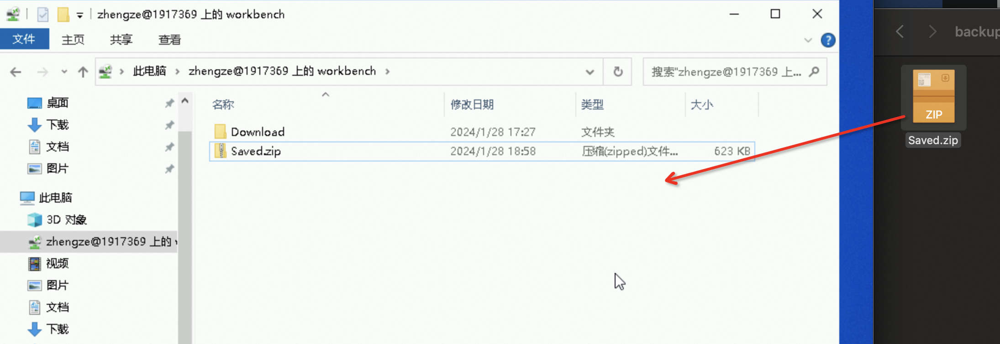
3. 覆盖前，你需要先停止幻兽帕鲁服务器。你可以打开 PowerShell 然后输入并执行以下命令：
    ```powershell
    Get-Process -name PalServer-Win64-Test-Cmd | Stop-Process
    ```
    PowerShell 可以从这里打开：

    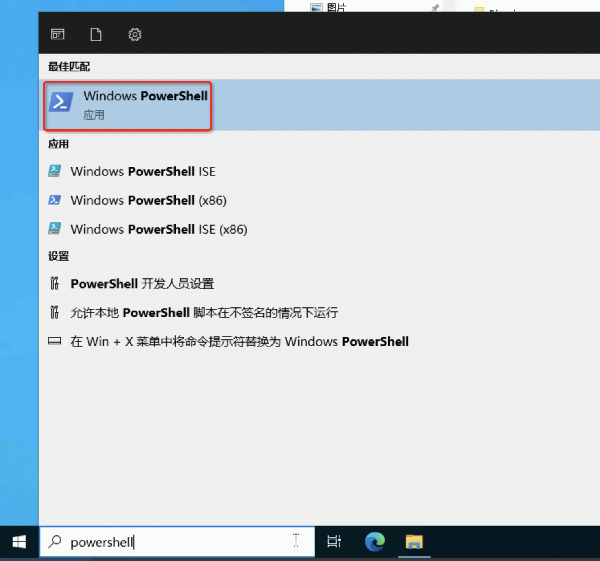  

    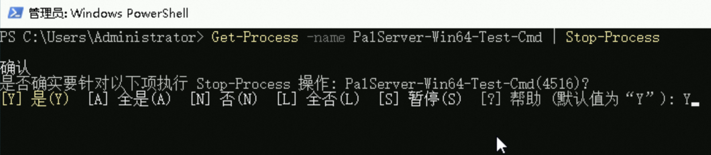
4. 将 Saved.zip 解并覆盖到 C:\Program Files\PalServer\steam\steamapps\common\PalServer\Pal\Saved 即可。
5. 最后，打开 PowerShell 启动帕鲁服务端程序，然后你就可以重新连接游戏了。
   ```powershell
   Start-Process "C:\Program Files\PalServer\steam\steamapps\common\PalServer\PalServer.exe"
   ```

### 3.2 Linux 系统的存档恢复
如果你原来是在 Linux 上搭建的 Palworld 服务器，通过计算巢迁移后，仍然会是 Linux 系统。为了恢复存档，你需要将步骤 1 中备份的存档覆盖到这里：
```
/home/ecs-assist-user/.steam/SteamApps/common/PalServer/Pal/Saved
```

具体操作：
1. 参考步骤 1，远程连接到 Linux 服务器。
2. 打开文件树，然后找到幻兽帕鲁存档位置，将存档压缩包上传到 Pal 目录中。

    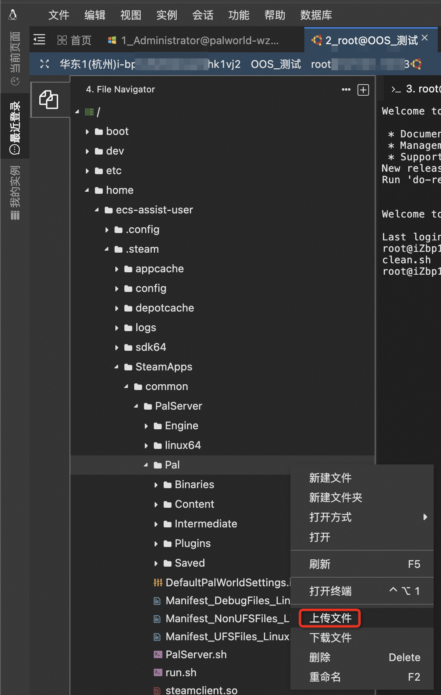
3. 覆盖前，你需要先停止幻兽帕鲁服务器。你可以使用如下命令：
    ```bash
    systemctl stop pal-server
    ```
4. 然后你可以通过如下命令，来替换存档：
    ```bash
    # 备份新服务器上的存档
    mv /home/ecs-assist-user/.steam/SteamApps/common/PalServer/Pal/Saved /home/ecs-assist-user/.steam/SteamApps/common/PalServer/Pal/Saved_backup
    # 将原有存档解压，放到 Saved 位置
    tar -xvf /home/ecs-assist-user/.steam/SteamApps/common/PalServer/Pal/PalSaved.tar -C /home/ecs-assist-user/.steam/SteamApps/common/PalServer/Pal/
    mv /home/ecs-assist-user/.steam/SteamApps/common/PalServer/Pal/PalSaved /home/ecs-assist-user/.steam/SteamApps/common/PalServer/Pal/Saved
    ```
5. 最后，启动幻兽帕鲁服务端程序，然后你就可以重新连接游戏了。
    ```bash
    systemctl start pal-server
    ```
